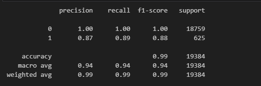
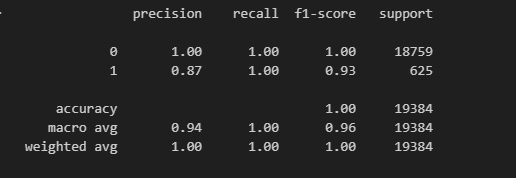

# Credit Risk Analysis Report
 

## Table of Content
- [Overview of the Analysis](#overview-of-the-analysis)
- [Results](#results)
- [Summary](#summary)

## Overview of the Analysis

The purpose of this analysis is to develop a predictive model for assessing loan risk. Loan risk assessment is essential for financial institutions to make informed lending decisions. The goal is to build a model that accurately classifies loans as either "healthy" (0) or "high-risk" (1) based on the provided financial information. The primary objective is to identify loans that are at a high risk of defaulting, allowing the lender to manage risk effectively. To understand the distribution of the loan_status variable, you can use value_counts() to count the number of loans in each category. This information helps assess the class balance, which can be important when building a predictive model, as imbalanced classes may require special handling.

#### Financial Information

**loan_size:** The size or amount of the loan applied for.\
**interest_rate:** The interest rate associated with the loan.\
**borrower_income:** The income of the loan applicant.\
**debt_to_income:** The debt-to-income ratio (DTI) of the applicant.\
**num_of_accounts:** The number of financial accounts the applicant has.\
**derogatory_marks:** The count of derogatory marks on the applicant's credit report.\
**total_debt:** The total debt amount the applicant owes.

#### Prediction Target

**loan_status:** This binary variable indicates whether the loan is "healthy" (0) or "high-risk" (1).

#### Stages of the Machine Learning Process

- Choose machine learning algorithms suitable for binary classification.
- Spilt the data into training and testing sets.
- Create a Logistic Regression Model with the orginal data.
- Predict alogistic regression model with resample training data.

#### Method Used

Two techniques used for this problem were logistic regression and resampling methods. The reason logistic regression was used is because it is a straightforward algorithm for binary classification. Due to the class imbalance, the resampling method was used to increase the minority class (high-risk loan) to obtain a balanced dataset. 

## Results

#### Machine Learning Model 1: Imbalanced Data

**Balanced Accuracy Score for Model 1:** 94%\
The balanced accuracy score for Model 1 indicates how well the model maintains accuracy across both classes, even with imbalanced data.\

**Precision, Recall, and F1-Score for Healthy-Loan (Class 0):**\
**Precision:** 100%\
This means that when the model predicts a loan as "healthy," it is correct 100% of the time.\
**Recall:** 100%\
The model identifies all actual healthy loans correctly.\
**F1-Score:** 100%\
A perfect balance between precision and recall for healthy loans.\
**Precision, Recall, and F1-Score for High-Risk Loan (Class 1):**\
**Precision:** 87%\
When the model predicts a loan as "high-risk," it is correct 87% of the time.\
**Recall:** 89%\
The model correctly identifies 89% of actual high-risk loans.\
**F1-Score:** 88%\
A harmonic mean of precision and recall, providing an overall measure of accuracy for high-risk loans.

#### Machine Learning Model 2: Oversample Data

**Balanced Accuracy Score for Model 2:** 99%\
The balanced accuracy score for Model 2 is notably high, demonstrating its effectiveness with oversampled data.\

**Precision, Recall, and F1-Score for Healthy-Loan (Class 0):**\
**Precision:** 100%\
The model correctly predicts healthy loans with 100% accuracy.\
**Recall:** 100%\
All actual healthy loans are correctly identified by the model.\
**F1-Score:** 100%\
A perfect F1-score balance for healthy loans.\
**Precision, Recall, and F1-Score for High-Risk Loan (Class 1):**\
**Precision:** 87%\
The model's precision for high-risk loans is 87%, indicating that 87% of the predicted high-risk loans are correct.\
**Recall:** 100%\
The model successfully identifies all actual high-risk loans.\
**F1-Score:** 93%\
A high F1-score for high-risk loans, reflecting the model's overall accuracy.

## Summary

#### Machine Learning Model 1: Imbalanced Data

**Balanced Accuracy Score:** 94%\
**Precision for High-Risk Loan (Class 1):** 87%\
**Recall for High-Risk Loan (Class 1):** 89%\
**F1-Score for High-Risk Loan (Class 1):** 88%

#### Machine Learning Model 2: Oversampled Data

**Balanced Accuracy Score:** 99%\
**Precision for High-Risk Loan (Class 1):** 87%\
**Recall for High-Risk Loan (Class 1):** 100%\
**F1-Score for High-Risk Loan (Class 1):** 93%

#### Recommendation

Based on the prediction and specific problem, it is recommended to use model 2, which was trained on oversampled data. The reason is that the balanced accuracy score of 99% compared to model 1's 94%. It has a higher recall of 100% compared to model 1's 89%. This means it correctly identified all actual high-risk loans. This is highly crucial because, in a lending context, it is more important to accurately predict high-risk loans to mitigate potential defaults and associated financial risks. Both models have a 100% in precision, recall, and F1-score in healthy loans. As stated previously, it is more critical to predict high-risk loans (Class 1) accurately because of the type of business this problem is based on. 